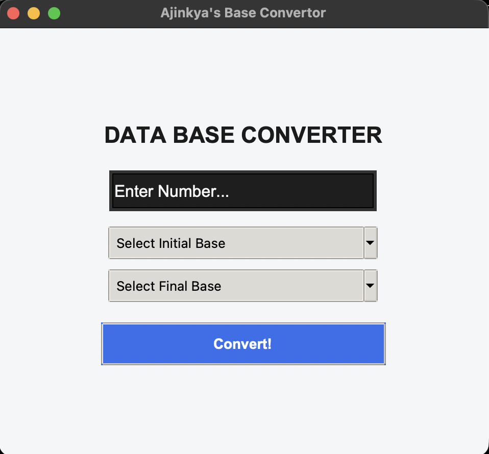
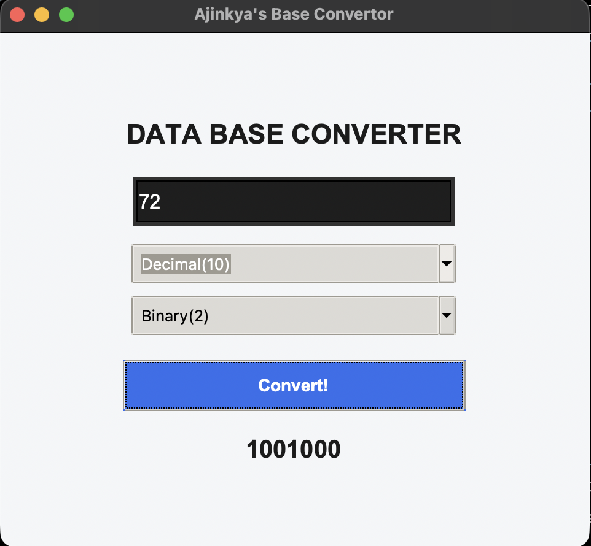

# 🔢 Data Base Converter

A **Python-based GUI application** built using **Tkinter** that allows users to convert numbers between different number systems including **Decimal, Binary, Octal, and Hexadecimal**.

The application provides a simple and clean interface where users can select an initial base and a final base to perform the conversion.

---

## ✨ Features

* 🔢 Convert between Decimal, Binary, Octal, and Hexadecimal
* 🔄 Convert numbers from any supported base to another
* 🖥️ Simple and clean graphical interface
* 🎯 Easy-to-use dropdown menus
* ⚠️ Error handling for invalid inputs
* ❌ Displays errors for incorrect number formats
* 🔤 Supports hexadecimal values using letters A–F
* 🎨 Styled interface using Tkinter and ttk

---

## 🛠️ Technologies Used

* **Python**
* **Tkinter** – GUI development
* **ttk** – Styled GUI components

---

## 📸 Screenshots

### Interface



### Output



---

## 📂 Project Structure

```text
Data-Base-Converter/
│
├── Base_convertor.py
├── screenshots/
│   ├── interface.png
│   └── output.png
├── .gitignore
└── README.md
```

---

## ⚙️ Installation

### 1. Clone the repository

```bash
git clone https://github.com/AJINKYA250708/Base_Converter.git
```

### 2. Open the project folder

```bash
cd Base_Converter
```

### 3. Run the program

```bash
python Base_convertor.py
```

> Tkinter is generally included with Python, so no additional libraries are required.

---

## ▶️ How to Use

1. Enter the number you want to convert.
2. Select the **Initial Base**.
3. Select the **Final Base**.
4. Click **Convert!**
5. The converted value will be displayed on the screen.

### Supported Bases

| Number System | Base |
| ------------- | ---: |
| Decimal       |   10 |
| Binary        |    2 |
| Octal         |    8 |
| Hexadecimal   |   16 |

---

## 🧠 Conversion Logic

The application first converts the entered number into its **decimal representation** and then converts that value into the selected final base.

The conversion is performed using a custom `to_base()` function rather than relying entirely on Python's built-in conversion functions.

---

## 💡 Future Improvements

* 📋 Add copy-to-clipboard functionality
* 🔄 Add a **Swap Bases** button
* 🕐 Add conversion history
* 🎨 Add light/dark mode
* 🔢 Add support for more number systems
* ⌨️ Add keyboard shortcuts
* 📱 Improve the interface for different screen sizes

---

## 🎯 Learning Outcomes

Through this project, I practiced:

* Python GUI development using Tkinter
* Functions and loops
* Number-system conversions
* Working with binary, octal, decimal, and hexadecimal numbers
* User input validation
* Exception handling
* Using Tkinter `ttk` widgets
* Building a simple desktop application

---

## 👨‍💻 Author

**Ajinkya Mahajan**

B.Tech CSE (Data Science) Student at VIT Chennai

---

## 📜 License

This project is available for educational and personal use.
